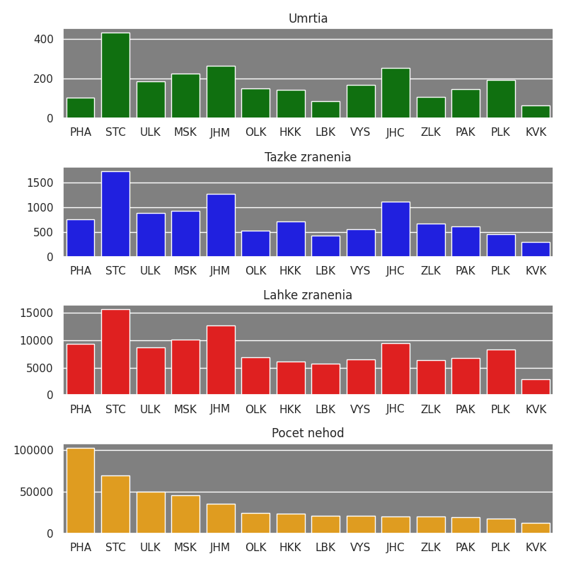
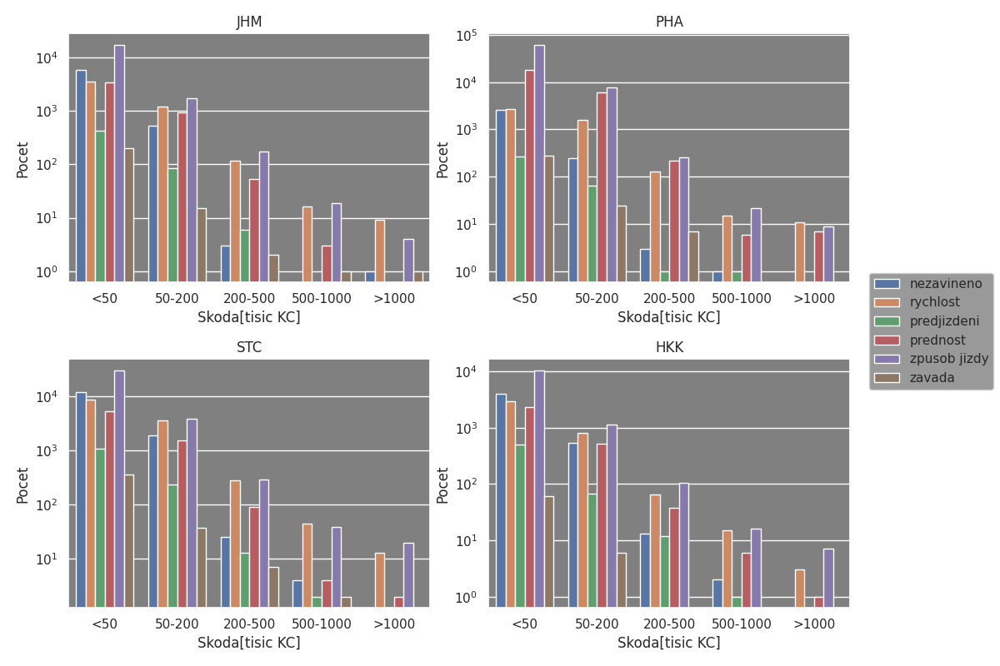
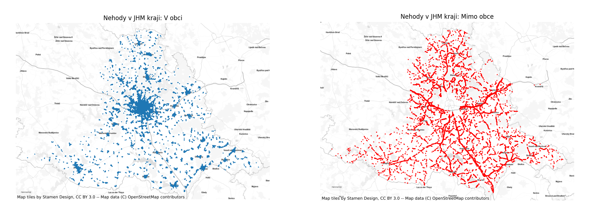
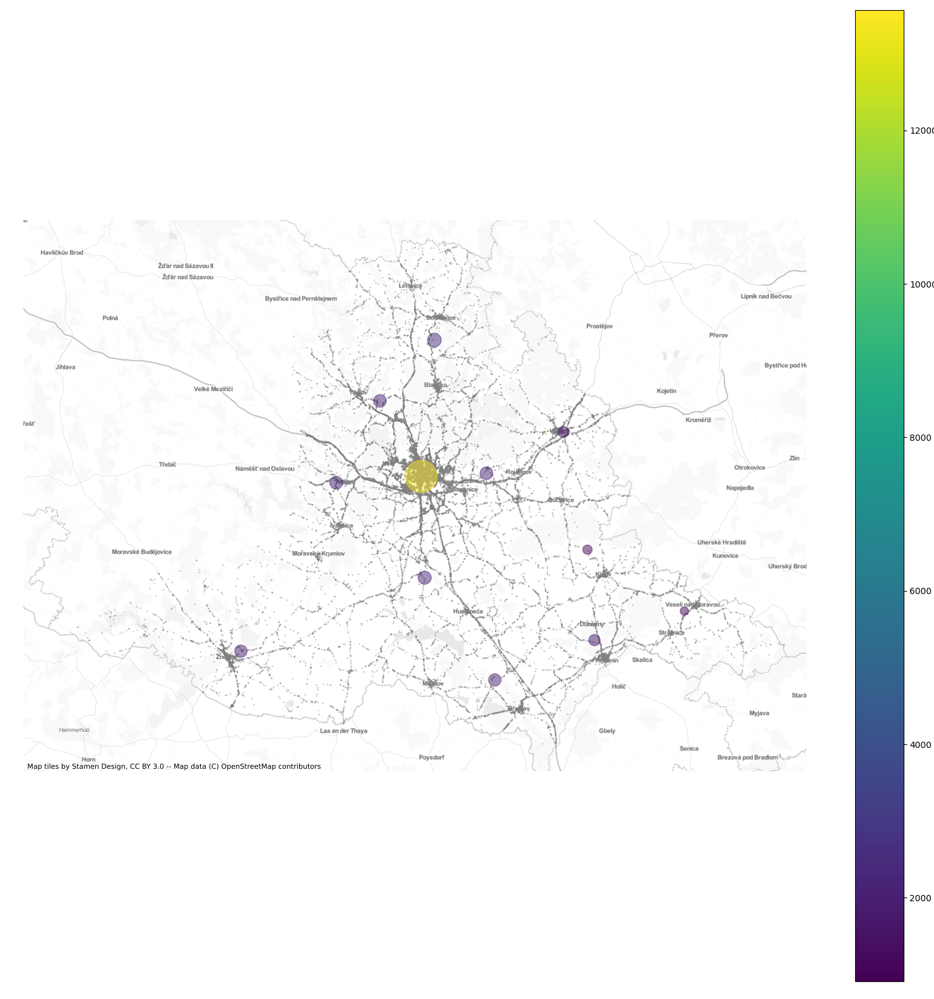
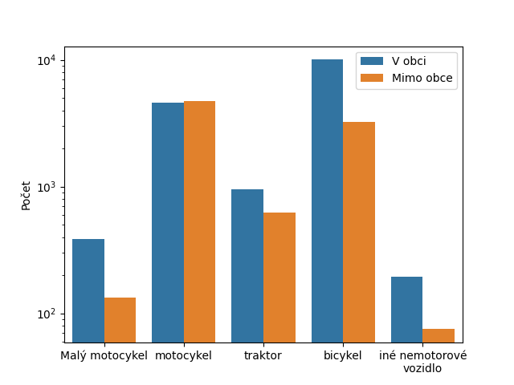

# BUT-FIT-IZV

3-part analysis of the Czech Republic police data about traffic accidents.

## Part1
Loads data from police to a pandas dataframe and transforms into a more desirable format.

## Part2
Exploratory analysis and visualization of the data using matplotlib.

### Number of injuries from accidents by severity and region:

### Causes of accidents by count for 4 selected regions:

### State of the road surface during accidents for 4 selected regions:

## Part 3
Plotting of geographical data about accidents.

### Visualization of accidents in South-Moravian region.

### Accident clustering using k-means algorithm from scikit-learn library.

### Exploratory analysis of cycling accidents comparing inner city and country roads.

